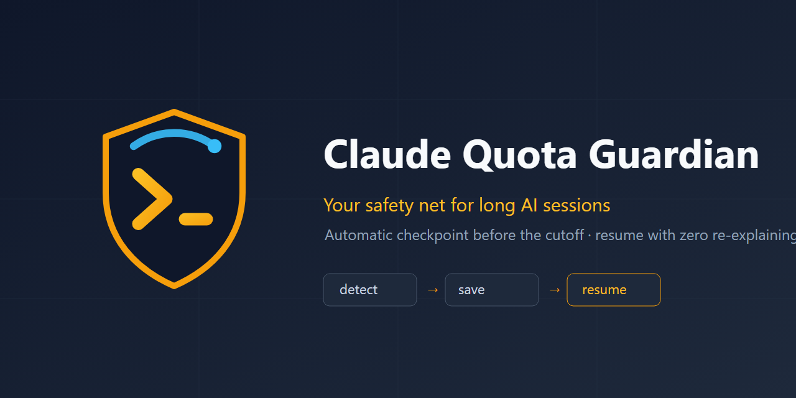

<p align="center"></p>

# 🛡️ Claude Quota Guardian

> 🇪🇸 [Versión en español](README.md)

**Your safety net for long AI sessions.** Guardian watches your **real Claude account quota** in the background (5h session, weekly, and per-model limits) and, right before the cutoff, forces a structured checkpoint that the next session resumes on its own — no lost thread, no re-explaining. It ships with a **browser extension** to watch your usage live.

## The problem

Anyone who runs long sessions with an AI agent knows the moment: you're hours into building something, your plan quota runs out, and the session dies mid-task. What follows is worse than the cutoff itself: reopening, re-explaining everything from scratch, and watching the agent retry approaches that had already failed.

## What Guardian does

When a **Claude Code terminal session** approaches your **real plan limit**, Guardian:

1. **Reads your real quota** (the same you see in Settings → Usage), not an estimate. Through your account's usage endpoint it gets all three windows: **Session (5h)**, **Weekly (all models)** and **per-model limits** (e.g. Fable). The block is driven by whichever account-wide window is closest to its cap (session or weekly); per-model limits are **advisory only** (if one model is spent, you keep working with another).
2. **Stops new work** with a real tool block (`PreToolUse` hook): the agent cannot keep burning quota without saving first.
3. **Forces a structured checkpoint** (`/continuity-checkpoint`): what was being built, what worked (with evidence), what did NOT work and why, the state of every file touched, decisions made, and the exact next step. It's written **dense** (caveman style: no filler, fragments; identifiers/paths/errors kept intact) so reopening spends the fewest possible tokens re-reading it.
4. **Notifies you when the quota resets** (background watcher with OS notifications and adaptive polling — 15→3→1 min as your account fills up).
5. **Resumes on its own**: the next time you open Claude Code in that project, a `SessionStart` hook injects the full checkpoint as context. The agent announces the next step and continues — zero re-explanation.

```
[Normal work] -> PostToolUse: check-usage.js
       |
       |-- quota below threshold -> no-op
       |
       `-- Session/Weekly >= threshold -> pending.json + OS notification + block
                        |
                        v
                Claude runs /continuity-checkpoint
                -> writes checkpoint-<ts>.md
                -> ends the turn cleanly
                        |
              (you close Claude; quota resets later)
                        |
              quota-watcher (background) detects the reset
              -> notification: "ready to continue"
                        |
              You reopen Claude in the same project
                        |
                SessionStart: resume-context.js
                -> injects the full checkpoint
                        |
                Claude announces the next step and continues
```

No automatic relaunching: you decide when to reopen. Guardian only handles the save and the resume.

## Browser extension (usage monitor)

`extension/` contains a **Manifest V3** extension (Chrome/Edge/Brave) to **watch your usage live** without opening Settings:

- **Toolbar badge**: the % of the most-pressing window (session or weekly), colored green/orange/red by how close it is to the cap. Refreshed in the background.
- **Popup**: Session (5h) and Weekly as the main bars; per-model limits (Fable, etc.) as advisory; a reset countdown for each window.
- **No tokens, no secrets**: it uses the same call the Claude app's own Usage screen makes, authenticated with your existing claude.ai session cookies. Only host permission: `claude.ai`. It sends nothing to third parties.

Install: `chrome://extensions` → Developer mode → **Load unpacked** → the `extension/` folder. Details in [extension/README.md](extension/README.md).

## Benefits (verifiable)

- **Real signal, not an estimate**: reads your account-wide quota (5h session / weekly / per-model) — the same number your account shows. The block fires on what will actually cut you off.
- **The 5h session — the fastest to deplete — is watched explicitly**, not as a side effect.
- **Zero lost context**: the checkpoint captures what automatic summaries lose — the approaches that failed and why, so they aren't retried.
- **Zero quota burned blindly**: the hard block prevents the agent from continuing work on a doomed session.
- **Works on any plan and any OS**: auto-detects only the installing user's quota (Pro/Max/Team) by reading Claude Code's OAuth token — a file on Windows/Linux, the **Keychain on macOS**.
- **Visual monitor**: browser extension with badge + popup (above).
- **One-command install, clean uninstall**: merges its hooks into `settings.json` without touching yours; the uninstaller only removes its own.
- **198 tests** on Node 18 and 20 (`npm test`, CI included).
- **Extensible to other AI providers**: adapter architecture; ships with notify-only monitoring of **OpenAI Codex CLI** today.

## Who is it for?

- **Claude Code users on Pro/Max/Team plans** who hit the 5h window during intense sessions.
- **Developers running autonomous agents** on long tasks (refactors, audits, multi-file features) where a mid-task cutoff costs hours.
- **Freelancers and small teams** who bill for outcomes and can't afford re-explaining context every session.
- **Multi-CLI users** who alternate between Claude Code and Codex and want a single safety net.

## Honest scope

- The full loop (detect → block → checkpoint → auto-resume) applies to **Claude Code in the terminal** (`entrypoint === "cli"`), the only surface with hooks and a real "end the turn" affordance. **Claude Code Desktop** gets the notify-only tier: warnings, never a block.
- Other providers (Codex today) are **notify-only**: without a hook system there is no blocking and no auto-resume — Guardian warns you in time to ask for a summary before the cutoff.
- Blocking is **100% driven by your real quota** by default. The local context % is measured and displayed but does not block unless you opt in as a fallback (useful when no quota signal exists — see [docs/configuration.md](docs/configuration.md)).
- Quota detection requires being logged into Claude Code with a Pro/Max/Team account (OAuth token). With a bare API key there are no session/weekly windows to watch.

## Requirements

- Node.js >= 18
- Claude Code (CLI) with hook support

## Install

### Option A — As a Claude Code plugin (1 command)

```
/plugin marketplace add LeonardoIAConsult/claude-quota-guardian
/plugin install claude-quota-guardian@claude-quota-guardian
```

Loads the four hooks + the `/continuity-checkpoint` command. Delivers the core loop (detect → block → checkpoint → auto-resume). The **quota-reset watcher** (notifies while Claude is closed) is exclusive to Option B. Details: [docs/plugin-packaging.md](docs/plugin-packaging.md).

### Option B — Standalone (full feature set)

```bash
git clone <repo-url> ~/.claude/claude-quota-guardian
cd ~/.claude/claude-quota-guardian
npm install
node bin/install.js
```

That single command: writes the default config, merges the hooks into `~/.claude/settings.json` (without overwriting yours), claims the `statusLine` slot for quota tracking (only if free), installs the `/continuity-checkpoint` command, and registers the watcher with your OS scheduler.

### Uninstalling

```bash
node bin/uninstall.js          # removes hooks, command and watcher
node bin/uninstall.js --purge  # also deletes saved checkpoints
```

### Testing your install

```bash
node scripts/simulate-threshold.js --pct 99.7
```

Prints a ready-to-run command that simulates a near-limit session and confirms the hook fires, without waiting for a real session to fill up.

## Configuration

Everything is optional with sensible defaults: thresholds, plan, watcher cadence, `blockOnContext` (context fallback), per-model warning, external providers. See [docs/configuration.md](docs/configuration.md).

## What's included

- **Core loop** — `hooks/check-usage.js` (quota detection), `hooks/enforce-checkpoint.js` (real blocking), `hooks/resume-context.js` (auto-resume). Terminal surface only.
- **Real quota reading** — `lib/usage-api.js`: account-wide quota (session/weekly/per-model) from your account's usage endpoint; OAuth token from a file or the macOS Keychain.
- **Browser extension** — `extension/`: usage monitor (badge + popup).
- **Background watcher** — `watcher/quota-watcher.js`: quota-reset notification + adaptive cadence.
- **Provider adapters** — `lib/adapters/codex.js`: notify-only monitoring of OpenAI Codex CLI sessions.
- **Installer / uninstaller** — `bin/install.js` / `bin/uninstall.js`.

## License

MIT
