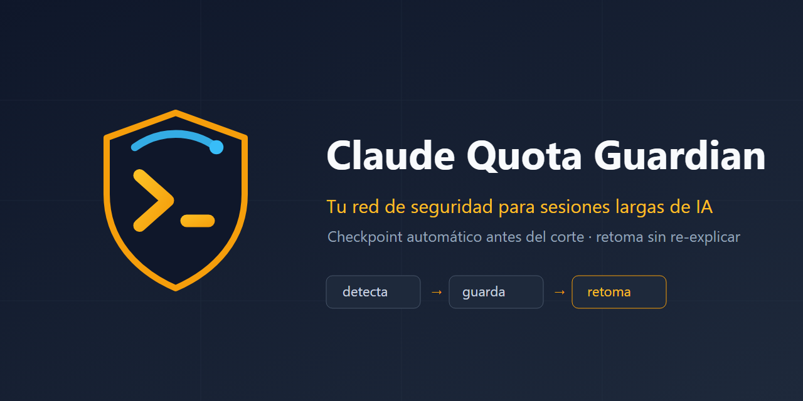

<p align="center"></p>

# 🛡️ Claude Quota Guardian

> 🇬🇧 [English version](README.en.md)

**Tu red de seguridad para sesiones largas de IA.** Guardian vigila en segundo plano la **cuota real de tu cuenta de Claude** (sesión de 5h, límite semanal y por-modelo) y, justo antes del corte, obliga a guardar un checkpoint estructurado que la próxima sesión retoma sola — sin perder el hilo, sin re-explicar nada. Incluye una **extensión de navegador** para ver tu consumo en vivo.

## El problema

Cualquiera que trabaje sesiones largas con un agente de IA conoce el momento: llevás horas construyendo algo, la cuota del plan se agota, y la sesión muere a mitad de una tarea. Lo que sigue es peor que el corte: reabrir, re-explicar todo desde cero, y ver al agente re-intentar caminos que ya habían fallado.

## Qué hace Guardian

Cuando una **sesión de Claude Code en terminal** se acerca al límite **real de tu plan**, Guardian:

1. **Lee tu cuota real** (la misma que ves en Ajustes → Uso), no una estimación. Vía el endpoint de uso de tu cuenta obtiene las tres ventanas: **Sesión (5h)**, **Semanal (todos los modelos)** y los **límites por modelo** (p. ej. Fable). El bloqueo lo gobierna la ventana que gatea todo (sesión o semanal); los límites por modelo **solo avisan** (si se agota un modelo, seguís con otro).
2. **Frena el trabajo nuevo** con un bloqueo real de herramientas (hook `PreToolUse`): el agente no puede seguir quemando cuota sin guardar primero.
3. **Fuerza un checkpoint estructurado** (`/continuity-checkpoint`): qué se estaba construyendo, qué funcionó (con evidencia), qué NO funcionó y por qué, estado de cada archivo, decisiones tomadas, y el próximo paso exacto. Se escribe **denso** (estilo caveman: sin relleno, fragmentos; identificadores/rutas/errores intactos) para gastar los mínimos tokens al reabrir.
4. **Avisa cuando la cuota se reinicia** (watcher en segundo plano con notificaciones del sistema, cadencia adaptativa 15→3→1 min según qué tan llena está la cuenta).
5. **Retoma solo**: al reabrir Claude Code en ese proyecto, un hook `SessionStart` inyecta el checkpoint completo como contexto. El agente anuncia el próximo paso y sigue — cero re-explicación.

```
[Trabajo normal] -> PostToolUse: check-usage.js
       |
       |-- cuota bajo el umbral -> no-op
       |
       `-- Sesión/Semanal >= umbral -> pending.json + notificación OS + bloqueo
                        |
                        v
                Claude ejecuta /continuity-checkpoint
                -> escribe checkpoint-<ts>.md
                -> cierra el turno limpio
                        |
              (cerrás Claude; la cuota se reinicia después)
                        |
              quota-watcher (fondo) detecta el reset
              -> notificación: "listo para continuar"
                        |
              Reabrís Claude en el mismo proyecto
                        |
                SessionStart: resume-context.js
                -> inyecta el checkpoint completo
                        |
                Claude anuncia el próximo paso y sigue
```

Sin relanzamiento automático: vos decidís cuándo reabrir. Guardian solo se encarga del guardado y la retoma.

## Extensión de navegador (monitor de consumo)

En `extension/` hay una extensión **Manifest V3** (Chrome/Edge/Brave) para **ver tu consumo en vivo** sin abrir Ajustes:

- **Insignia (badge)** en la barra: el % de la ventana más apretada (sesión o semanal), en verde/naranja/rojo según cercanía al tope. Se actualiza en segundo plano.
- **Popup**: Sesión (5h) y Semanal como barras principales; los límites por modelo (Fable, etc.) como aviso; cuenta regresiva de reinicio de cada ventana.
- **Sin tokens ni secretos**: usa la misma llamada que la pantalla de Uso de la propia app de Claude, autenticada con las cookies de tu sesión de claude.ai. Único permiso de host: `claude.ai`. No envía datos a terceros.

Instalar: `chrome://extensions` → Modo desarrollador → **Cargar descomprimida** → carpeta `extension/`. Detalle en [extension/README.md](extension/README.md).

## Beneficios (comprobables)

- **Señal real, no estimada**: lee la cuota account-wide de tu cuenta (sesión 5h / semanal / por-modelo) — el mismo número que ves en la app. El bloqueo se dispara por lo que de verdad te va a cortar.
- **La sesión de 5h — la que más rápido se agota — se vigila explícita**, no como efecto secundario.
- **Cero contexto perdido**: el checkpoint captura lo que un resumen automático pierde — los caminos que fallaron y por qué, para que no se re-intenten.
- **Cero cuota quemada a ciegas**: el bloqueo duro impide que el agente siga trabajando sobre una sesión condenada.
- **Funciona para cualquier plan y cualquier OS**: detecta solo la cuota de quien lo instale (Pro/Max/Team) leyendo el token OAuth de Claude Code — archivo en Windows/Linux, **Keychain en macOS**.
- **Monitor visual**: extensión de navegador con badge + popup (arriba).
- **Instalación de 1 comando, desinstalación limpia**: mergea sus hooks en `settings.json` sin tocar los tuyos; el uninstaller solo quita lo suyo.
- **198 tests** en Node 18 y 20 (`npm test`, CI incluido).
- **Extensible a otros proveedores de IA**: arquitectura de adaptadores; hoy incluye monitoreo notify-only de **OpenAI Codex CLI**.

## ¿Para quién es?

- **Usuarios de Claude Code con plan Pro/Max/Team** que chocan contra la ventana de 5h en sesiones intensas.
- **Devs que corren agentes autónomos** en tareas largas (refactors, auditorías, features multi-archivo) donde un corte a mitad de camino cuesta horas.
- **Freelancers y equipos chicos** que facturan por resultado y no pueden pagar el costo de re-explicar contexto en cada sesión.
- **Usuarios multi-CLI** que alternan Claude Code y Codex y quieren una sola red de seguridad.

## Alcance honesto

- El loop completo (detectar → bloquear → checkpoint → retoma automática) aplica a **Claude Code en terminal** (`entrypoint === "cli"`), la única superficie con hooks y un "cerrá el turno" real. **Claude Code Desktop** recibe el tier notify-only: avisos, nunca bloqueo.
- Otros proveedores (Codex hoy) son **notify-only**: sin sistema de hooks no hay bloqueo ni retoma automática — Guardian te avisa a tiempo para pedirle un resumen antes del corte.
- El bloqueo es **100% guiado por tu cuota real** por defecto. El % de contexto local se mide y se muestra, pero no bloquea salvo que lo actives como fallback (útil si no hay señal de cuota, ver [docs/configuration.md](docs/configuration.md)).
- La detección de cuota requiere estar logueado en Claude Code con una cuenta Pro/Max/Team (token OAuth). Con API key suelta no hay ventanas de sesión/semanal que vigilar.

## Requisitos

- Node.js >= 18
- Claude Code (CLI) con soporte de hooks

## Instalación rápida

```bash
git clone <repo-url> ~/.claude/claude-quota-guardian
cd ~/.claude/claude-quota-guardian
npm install
node bin/install.js
```

Ese único comando: escribe la config por defecto, mergea los hooks en `~/.claude/settings.json` (sin pisar los existentes), reclama el `statusLine` para tracking de cuota (solo si está libre), instala el comando `/continuity-checkpoint` y registra el watcher en el programador de tareas de tu OS.

### Desinstalar

```bash
node bin/uninstall.js          # quita hooks, comando y watcher
node bin/uninstall.js --purge  # además borra los checkpoints guardados
```

### Probar la instalación

```bash
node scripts/simulate-threshold.js --pct 99.7
```

Imprime un comando listo para simular una sesión al límite y confirmar que el hook dispara, sin esperar a que una sesión real se llene.

## Configuración

Todo opcional, con defaults sensatos: umbrales, plan, cadencia del watcher, `blockOnContext` (fallback de contexto), aviso por modelo, proveedores externos. Ver [docs/configuration.md](docs/configuration.md).

## Qué incluye

- **Loop principal** — `hooks/check-usage.js` (detección de cuota), `hooks/enforce-checkpoint.js` (bloqueo real), `hooks/resume-context.js` (retoma automática). Solo superficie terminal.
- **Lectura de cuota real** — `lib/usage-api.js`: cuota account-wide (sesión/semanal/por-modelo) del endpoint de uso de tu cuenta; token OAuth desde archivo o Keychain (macOS).
- **Extensión de navegador** — `extension/`: monitor de consumo (badge + popup).
- **Watcher en segundo plano** — `watcher/quota-watcher.js`: aviso de reset de cuota + cadencia adaptativa.
- **Adaptadores de proveedor** — `lib/adapters/codex.js`: monitoreo notify-only de sesiones de OpenAI Codex CLI.
- **Instalador / desinstalador** — `bin/install.js` / `bin/uninstall.js`.

## Licencia

MIT
